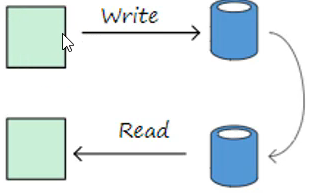
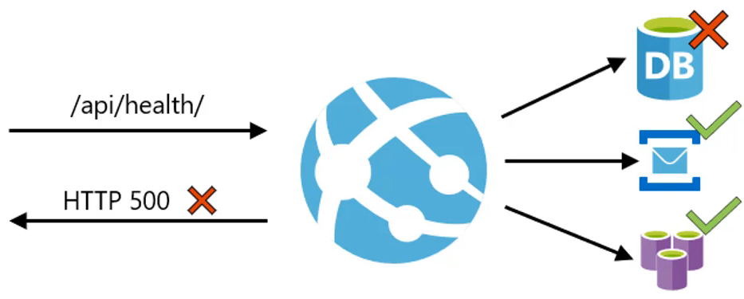

# Arquitectura de Aplicaciones Empresariales con .NET 8

Todo lo que necesitas para diseñar y construir Aplicaciones con una Arquitectura robusta, segura, confiable y escalable.. 

Fuente : https://www.udemy.com/course/arquitectura-aplicaciones-empresariales-con-net-core/?couponCode=KEEPLEARNING

## Tabla de Contenidos

1. [Fundamentos Arquitectura de Aplicaciones](#fundamentos-arquitectura-de-aplicaciones)
   - [Proceso de diseño](#proceso-de-diseño)   
   - [Desacoplamiento entre Componentes](#desacoplamiento-entre-componentes)   
   - [Inyección de Dependencias e Inversión de control](#inyección-de-dependencias-e-inversión-de-control)
   - [Capas vs Niveles](#capas-vs-niveles)   
   - [Principios de Diseño Solid ](#principios-de-diseño-solid)   
   - [Principales Estilos de Arquitectura ](#principales-estilos-de-arquitectura)   
2. [Arquitectura N-Capas con Orientacion al Dominio](#arquitectura-n-capas-con-orientacion-al-dominio)
3. [Definicion JSON Web Token(JWT)](#definicion-json-web-tokenjwt)
4. [Métricas de Código](#métricas-de-código)
    - [Indice de Mantenibilidad](#indice-de-mantenibilidad)
    - [Complejidad Ciclomática](#complejidad-ciclomática)
    - [Profundidad de la Herencia](#profundidad-de-la-herencia)
    - [Acoplamiento de Clases](#acoplamiento-de-clases)
    - [Líneas de Código](#línea-de-código)
5. [Versionar un API](#versionar-un-api)
6. [Patrón Health Check](#patrón-health-check)
7. [Comunicación basada en Eventos](#comunicación-basada-en-eventos)
    - [RabbitMQ](#rabbitmq)
8. [Middleware](#middleware)


## Fundamentos Arquitectura de Aplicaciones
El diseño de la arquitectura de una aplicación es el proceso por el cual se define una solución para los requisitos técnicos y operacionales del mismo

La arquitectura define que componentes conforman la aplicación, como se relacionan entre ellos, y como mediante su interacción llevan a cabo una funcionalidad especificada, cumpliendo con los criterios de calidad, como seguridad, disponibilidad, eficiencia, usabilidad, etc.

### Objetivo
Identificar los requisitos que producen un impacto en la estructura de la aplicacion y reducir los riesgos asociados con la construccion.

La arquitectura debe soportar los cambios futuros de la aplicacion, tanto del hardware y de funcionalidad demandada por los clientes.

#### Algunas preguntas a considerar:
1. En que entorno va a ser desplegado nuestra aplicacion?
2. Como va a ser el despliegue en produccion?
3. Como van a utilizar los usuarios nuestra app?
4. Que otros requisitos debe cumplir el sistema?, seguridad, rendimiento, concurrencia, configuracion, escalabilidad, interoperabilidad, etc
5. Que cambios en la arq pueden impactar a la app ahora o una ves desplegado?

### Conclusion
El objetivo final de la arquitectura es identificar los requisitos que producen un impacto en la estructura de la aplicación y reducir los riesgos asociados con la construcción. La arquitectura debe soportar los cambios futuros de la aplicación, del hardware y de funcionalidad demandada por los clientes.

- Mostrar la estructura del sistema pero ocultar los detalles
- Relizar todos los casos de uso
- Satisfacer en la medida de lo posible los intereses de los Stakeholders
- Ocuparse de los requisitos funcionales y de calidad (no funcionales)
- Determinar el tipo de aplicación a desarrollar
- Determinar los estilos arquitecturales que se usarán y principales cuestiones transversales

## Proceso de diseño
La diferencia entre un excelente proceso de diseño de Arquitectura y uno deficiente puede suponer el éxito o fracaso de nuestro Proyecto

Durante el proceso de diseño de la arquitectura se tratan y deciden temas importantes con la finalidad de crear un arquetipo o una plantilla básica de nuestra aplicación

- Qué tipo de aplicación se va a construir (Web, RIA, Escritorio, etc).
- Que estructura logica va a tener la aplicación (N-Capas, Componentes, etc).
- Que estructura física va a atener la aplicación (Cliente/Servidor, N-Tier. etc).
- Que riesgos hay que afrontar y como hacerlo (Seguridad, Rendimiento, Interoperabilidad, Mantenibilidad, etc).
- Que tecnologías vamos a usar (WCF, WPF, Web Api, Dapper, Entity Framework, .NET Core, JWT, etc)

### Requisitos previos
Para realizar de manera eficiente todo el proceso de diseño partiremos de la información que ha generado el proceso de captura de requisitos:
- Casos de uso o historias de usuario
- Requisitos funcionales y no funcionales
- Restricciones tecnológicas y de diseño en general
- Entorno de despliegue propuesto

### Etapas del proceso 
El proceso de diseño de Arquitectura es iterativo e incremental y costa de 5 etapas, este proceso se repite hasta completar el desarrollo de la aplicacion
1. Identificar los objetivos de la iteración
2. Seleccionar los casos de uso importantes
3. Realizar un esquema de la aplicacion
4. Identificar los principales riesgos
5. Crear arquitecturas candidatas


## Desacoplamiento entre Componentes

El desacoplamiento debería realizarse entre todos los objetos (con lógica de ejecución y dependencias) pertenecientes a las diferentes capas, pues existen ciertas capas que se deben integrar a la aplicación de una forma desacoplada.


"Tener preparado toda la estructura de la arquitectura de la aplicación de forma desacoplada y en cualquier momento poder inyectar funcionalidad para cualquier área o grupo de objetos, no tiene por qué ser sólo entre capas diferentes. "

Las técnicas de desacoplamiento están basadas en el Principio de Inversión de Dependencias


## Inyección de Dependencias e Inversión de control
### 1. Patrón de Inversión de Control (IoC)
Consiste en delegar a un componente o fuente externa, la función de seleccionar un tipo de implementación concreta de las dependencias de nuestras clases. En definitiva, este patrón describe técnicas para soportar una arquitectura tipo 'plug-in' donde los objetos pueden buscar instancias de otros objetos que requieren y de los cuales dependen

```Se refiere a un componente externo el cual tiene la función de seleccionar el tipo de implementación concreta de las dependencias de nuestras clases```

### 2. Patrón de Inyección de Dependencias (DI)
Es un patrón en el que se suplen objetos-dependencias a una clase en lugar de ser la propia clase quien cree los objetos-dependencias que necesita.

la forma más potente de implementar este patrón es mediante un 'Contenedor DI'. El contenedor DI intecta a cada objeto las dependencias-objetos necesarios según las relaciones o registro plasmado bien por código o en ficheros XML de configuración del Contenedor DI

```Se base en un framework externo, que basicamente se coloca la interfaz y la implementación  ```

Con .NET Core tenemos inyección de dependencia nativo ya que, básicamente este ha sido construido mediante interfaces


Vida útil de las dependencias de los servicios en .NET Core
- Transitorio (addTransient) : Se crea una nueva instancia, cada vez que se crea un servicio o son solicitadas

- Ambito (addScoped) : Se genera una nueva instancia para cada ambito. (Cada solicitud es un alcance). Dentro del ambito, el servicio es reutilizado

- Singleton (addSingleton) : Se crea solo una vez y se usa en todas partes

## Capas vs Niveles

Las Capas(Layers) se ocupan de la división lógica de componentes y funcionalidad, y no tienen en cuenta la localización física de componentes en diferentes servidores o en diferentes lugares.

Los Niveles(Tiers) se ocupan de la distribución física de componentes y funcionalidad en servidores separados, teniendo en cuenta topología de redes y localizaciones remotas.

Aunque tanto las Capas(Layers) como los Niveles(Tiers) usan conjuntos similares de nombres(Presentación, servicios, negocio y datos), es importante no confundirlos y recordar que solo los Niveles(Tiers) implican una separación física


## Principios de Diseño Solid


### 1. Principio de Única Responsabilidad
Una clase debe tener una unica responsabilidad o característica. Dicho de otra manera, una clase debe tener una única razón por la que está justificado realizar cambios sobre su código fuente. Una consecuencia de este principio es que, de forma general, las clases deberían tener pocas dependencias con otras clases-tipos.


### 2. Principio Abierto Cerrado
Una clase debe estar abierta para la extensión y cerrada para la modificación. Es decir, el comportamiento de una clase debe poder ser extendido sin necesidad de realziar modificaciones sobre el código de la misma.


### 3. Princio de Sustitución de Liskov
Los subtipos deben poder ser sustituibles por sus tipos base (interfaz o clase base). Este hecho se deriva de que el comportamiento de un programa que trabaja con abstracciones (interfaces o clases base) no debe cambiar porque se sustituya una implementación concreta por otra. Los programas deben hacer referencia a las abstracciones, y no a las implementaciones


### 4. Principio de Segregación de Interfaces
Las implementaciones de las Interfaces en las clases no deben estar obligados a implementar métodos que no se usan. Es decir, las interfaces de clases deben ser específicos dependiendo de quién los consume y por lo tanto, tienen que estar granularizados - segregados en diferentes interfaces no debiendo crear nunca grandes interfaces


### 5. Principio de Inversión de Dependencias
Las abstracciones no deben depender de los detalles - Los detalles deben depender de las abstracciones. Las dependencias directas entre clases deben ser reemplazadas por abstracciones(interfaces) para permitir diseños top-down sin requerir primero el diseño de los niveles inferiores.


## Otros principios claves

### El diseño de componentes debe ser altamente cohesivo
No sobrecargar los componentes añadiendo funcionalidad mezclada o no relacionada. Por ejemplo, evitar mezclar lógica de acceso a datos con lógica de negocio perteneciente al Modelo del Dominio

### Mantener el código transversal abstraído de la lógica específica de la aplicación
El código transversal se refiere a código de aspectos horizontales, cosas como la seguridad, gestión de operaciones, logging, instrumentalización, etc.

### Separación de Preocupaciones-Responsabilidades
Divir la aplicación en distintas partes minimizando las funcionalidades superpuestas entre dichas partes. El factor fundamental es minimizar los puntos de interacción para conseguir una alta cohesión y un bajo acoplamiento

### No repetirse(DRY)
Se debe especificar 'la intención' en un único sitio en el sistema. Por ejemplo, en términos del diseño de una aplicación, una funcionalidad específica se debe implementar en un único componente; esta misma funcionalidad no debe estar implementada en otros componentes

## Principales Estilos de Arquitectura
Un estilo de arquitectura es una familia de arquitecturas que comparten determinadas características

### N-Niveles


Es una arquitectura tradicional para aplicaciones empresariales. Las dependencias se administran mediante la división de la aplicación en capas que realizan funciones lódicas como presentaciones, lógica de negocios y acceso a datos. Una capa solo puede llamar a las capas que se encuentran por debajo de ella


### Web-Cola-Trabajo


En este estilo, la aplicación tiene un Front-End web que controla las solicitudes HTTP y un trabajo de back-end que realiza tareas de uso intensivo de la CPU u operaciones de larga duración. El Front-End se comunica con el trabajo a través de una cola de mensajes asincrónicos.

La arquitectura Web-Cola-Trabajo es adecuada para dominios relativamente sencillos con algunas tareas que consumen muchos recursos


### Microservicios


Una aplicación de microservicios se compone de muchos servicios pequeños e independientes. Cada servicio implementa una sola función empresarial. Los servicios están acoplados de forma flexible y se comunican a través de contratos de API

Una arquitectura de microservicios es más compleja a la hora de compilar y administrar 

### CQRS



El estilo CQRS, separa las operaciones de lectura y escritura en modelos independientes. Esto permite aislar las partes del sistema que actualizan los datos de las partes que leen los datos.


### Arquitectura Basa en Eventos


Usa un modelo de publicacion-suscripcion en el que los productores publican eventos y los consumidores se suscriben a ellos. Los productores son independientes de los consumidores y estos, a su vez. Son independientes entre si. Se deberia tenerlo en cuenta para aplicaciones que consumen y procesan un gran volumen de datos con una latencia muy baja

## Arquitectura N-Capas con Orientacion al Dominio

### Definicion 
El objetivo de esta arquitectura marco es proporcionar una base consolidada para un tipo concreto de aplicaciones: "Aplicaciones empresariales complejas"


### Diseño de un microservicio DDD
El diseño guiado por el dominio(DDD) propone un modelado basado en la realidad de negocio con relacion a sus casos de uso

En el contexto de la creación de aplicaciones, DDD hace referencia a los problemas como dominios. Describe áreas con problemas independientes como contextos delimitados y resalda un lenguaje comun para hablar de dichos problemas

### Niveles en microservicios de DDD
1. Nivel de aplicacion: Este nivel debe mantenerse estrecho. No contiene reglas de negocios ni conocimientos, sino que solo coordina tareas y delega trabajo a colaboraciones de objetos de dominio en el siguiente nivel
2. Nivel del Modelado del Dominio: Responsable de representar conceptos del negocio, información sobre la situación del negocio y reglas de negocio
3. Nivel de Infraestructura: Es la forma en que los datos inicialmente se conservan en las entidades de dominio se guardan en base de datos o en otro almacen


## Definicion JSON Web Token(JWT)
Un token es una cadena alfanumérica con caracteres aparantemente aleatorios, los JWT engloba una estructura, la cual puede ser desencriptada por el servidor y de esta forma, autenticarnos como usuario en la aplicación.


## Métricas de Código

Las metricas de codigo son un conjunto de medidas de software que brindan a los desarrolladores una mejor compresión del codigo que estan desarrollando


### Indice de Mantenibilidad
Calcula un valor de indice entre 0 y 100, lo cual representa la relativa facilidad de mantener el codigo. Un valor alto significa una mejor mantenibilidad del codigo

#### Umbrales : 
* 0-9 = Rojo, 10-19 = Amarillo, 20-100 = Verde

### Complejidad Ciclomática
Mide la complejidad estructural del código. Se obtiene calculando el número de diferentes rutas de código en el flujo del programa. Un programa que tiene un flujo de control complejo requiere más pruebas para lograr una buena cobertura de código y es menos mantenible

#### Umbrales : 
* Valores Bajos

### Profundidad de la Herencia
Indica la cantidad de clases diferentes que se heredan entre si, hasta la clase base. La profundidad de herencia es similar al acoplamiento de clases en que un cambio en una clase base puede afectar a cualquiera de sus clases heredadas. Cuanto mayor sea este numero, mayor sera la herencia y mayor sera la posibilidad de que las modificaciones de la clase base produzcan un cambio radical.

#### Umbrales : 
* Valores Bajos

### Acoplamiento de Clases
Mide el acoplamiento a clases unicas a traves de parametros, variables locales, tipos de retorno, llamadas a metodos, etc

Un buen diseño de software dicta que los tipos y metodos deben tener una alta cohesion y un bajo acoplamiento. El alto acoplamiento indica un diseño que es dificil de reutilizar y mantener debido a sus muchas interdependencias con otros tipos

#### Umbrales : 
* Valores Bajos

### Líneas de Código
Indica el numero exacto de lineas de codigo fuente que estan presentes en su archivo fuente, incluidas las lineas en blanco. Esta metrica esta disponible a partir de Visual Studio 2019 version 16.4 y Microsoft.CodeAnalysis.Metrics(2.9.5)

#### Umbrales : 
* 30 lineas por metodo


## Versionar un API
El control de versiones de API es uno de los ingredientes mas importantes de una estrategia de API exitosa porque es uno de los puntos de contacto mas importante entre los proveedores de API y los consumidores de API

Endenter por que?: API, es una promesa de realizar los servicios descritos cuando se le solicite de manera especifica,
- un contrato nunca debe ser roto  unilateralmente por ninguna de las partes y las consecuencias de ello seran siempre negativas
- un control de versiones de API deficiente conducira a la inestabilidad y provocara fricciones con nuestros consumidores de API, al contrario, un control de versiones de API solido conducira a la estabilidad y mejorara la experiencia del desarrollador

Saber cuando?: Las APIs, son contratos vivos y deberian poder crecer y mejorar de manera continua, sin embargo, esto no significa la ruptura del contrato continuamente. La clave esta en comprender que cambios implican la ruptura del contrato y cuales no. Recuerde, lo mas que le encantara a un consumidor de API es la estabilidad
- Que cambios romperan un contrato API?, cambios continuos tienden a aser aditivos, agregar nuevos campos o recursos anidados a sus representaciones de recursos, agregar nuevos puntos finales
- Los cambios importantes son cambios que requieren que el consumidor de la api realice adecuaciones para continuar consumiendo la API
  - Eliminar o cambiar el nombre de una ruta
  - Eliminar/Renombrar parametros
  - Agregue una restriccion en un parametro, como isRequired
  - Eliminar/Cambiar el nombre de un elemento(campo) de solicitud o respuesta
- La unica forma de minimizar la consecuencias es un plan de comunicacion solido para ayudar al consumidor de API a planificar cuando integrar la nueva version de API

Decidir como? 
- Tipos de Versiones de API
  - Parametros de Consulta (Query String),  https://api.example.com/users/{id}?version=v1
  
  


  - Encabezado personalizado (Header), GET https://api.example.com/users/{id} with header Api-Version: 2.0 

  

  - Parametros en la URI (Path), https://api.example.com/v1/users/{id} es recomendable utilizar este versionamiento

  


- Versionado semantico como major.minor.patch por ejemplo 1.2.0
  - Version PRINCIPAL, cuando realiza cambios que rompen el contrato de la API
  - Version MENOR, cuando agrega funcionalidad de manera compatible con versiones anteriores
  - Version PATCH, cuando realiza correciones de errores compatibles con versiones anteriores 

Los valores MINOR y PATCH son transparentes para el cliente y se utilizaran internamente 

## Patrón Health Check
Los Health Check o comprobaciones de salud nos permite determinar el estado general y la disponibilidad de nuestra infraestructura de aplicaciones.
  - Se exponen como endpoints HTTP y se pueden configurar para proporcionar informacion para varios escenarios de monitoreo, como el tiempo de respuesta y el uso de memoria de nuestra aplicacion o si nuestra aplicacion puede comunicrase con nuestro proveedor de base de datos(Healthy, Degraded, Unhealthy)

- /health
- /healthchecks-ui

### Tipos : 
- Basic health probes(pruebas basicas de salud), Estas comprobaciones permiten determinar si nuestra aplicacion esta saludable o no
- System (Sistema), Brindan una gran cantidad de información, como el almacenimiento en disco y el uso de memoria del host
- Database (Base de Datos), Permiten determinar si nuestro proveedor de base de datos esta en linea
- Custom (Personalizados), permite comprobar un servicio de terceros o una api en la que se basa nuestra aplicacion. 

Los servicios deben implementar un Endpoint de verificacion de estado, que devuelve el estado de salud del servicio

Se requiere generar una alerta cuando falla una instancia de servicio y las solicitudes deben enrutarse a instancias de servicio en funcionamiento

  


## Comunicación basada en Eventos


  

Es util cuando solo se requiere comunicar o informar que algo sucedió, No se está solicitando ni pidiendo nada, por lo que no necesita una respuesta

### Patrón Publisher-Subscriber
Permite que una aplicacion anuncie ventos a varios consumidores interesados de forma asincrónica, sin vincular a los remitentes con los receptores


#### Contexto y Problema
- En las aplicaciones distribuidas o basadas en microservicios, a menudo los componentes del sistema necesitan proporcionar información a otros componentes a medida que ocurren los eventos
- La mensajeria asincronica es una forma efectiva de desvincular a los publicadores de los consumidores y evitar bloquear al publicador para esperar una respuesta

#### Solucion
Introducir un sistema de mensajeria asincronica que incluya lo siguiente
- Message Broker
- Publisher
- Subscriber
- Mensaje: Eventos o Comandos
- Canales
#### Beneficios
- Desacopla los subsistemas que todavia necesitan comunicarse
- Aumenta la escalabilidad y mejora la capacidad de respuesta del publicador
- Mejora la fiabilidad, soportan cargas de trabajo pesadas y manejo de fallas
- Permite el procesamiento diferido o programado
- Permite una integración más sencilla entre sistemas que utilizan diferentes plataformas, lenguajes de programación o protocolos de comunicación

### RabbitMQ
Es un broker de mensajeria de codigo abierto, distribuido y escalable, que sirve como intermediario para la comunicacion eficiente entre productores y consumidores

https://www.rabbitmq.com/docs/download

En RabbitMQ se definen colas que van a almacenar los mensajes que envian los productores hasta que las aplicaciones consumidoras obtienen el mensaje y lo procesan


#### Tipos de Intercambios en RabbitMQ
- Direct, El mensaje se enruta a las colas y las claves de enlace conside exactamente con la clave de enrutamiento del mensaje
- Topic, Se basa en la concidencia de comodines entre la clave de enrutamiento y el patron de enrutamiento especificado en cada cola
- Fanout, Enruta los mensaje a todas las colas vinculadas a el


## Middleware
- Componente que se ensambla en una canalizacion de una aplicacion para controlar las solicitudes y las respuestas.  Cada componente puede hacer lo siguiente
  -  Elegir si se pasa la solicitud al siguiente componente de la canalizacion
  - Realizar trabajos antes y despues del siguiente componente de la canalizacion
- Es una serie de instrucciones de código que se agregan al ciclo de vida de una petición HTTP
- Provee una ejecución de peticiones a través de capas
- Facilitan la implementación de interceptores y filtros sobre las peticiones en una API
- Se utilizan para manejar problemas transversales a un nivel inferior, como las excepciones, logs y validaciones

### Pipeline Middleware


Los middlewares personalizados deben de colocarse entre el middleware de **Autorizacion ** y el de endpoints.

## MediatR - Pipeline Behaviors
Cada operaciones esta representada por solicitud o request y se envia al handler, la logica la implementa el handler, pero que pasa si quieres agregar loggin, exception, validation, catching etc

